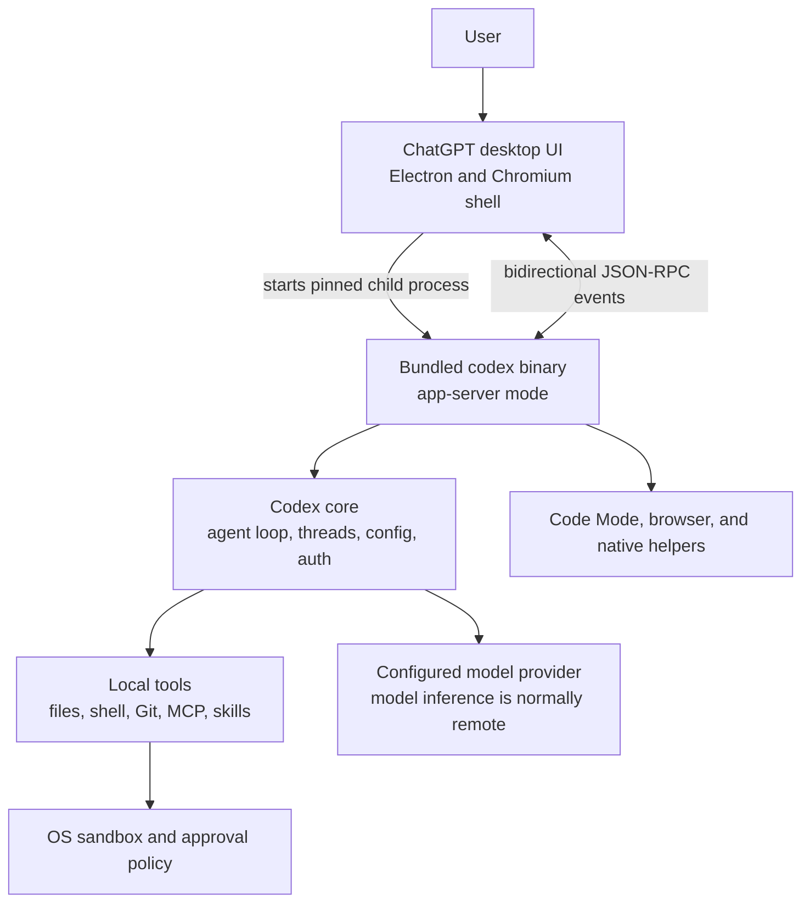

# How ChatGPT Desktop Uses the Codex Runtime

This is a descriptive reference, not a technical preference. It records what
is publicly documented and what was observed in a local macOS installation on
2026-08-12. Product packaging and internal behavior may change.

## Short answer

The ChatGPT desktop app uses Codex CLI infrastructure for local Codex work, but
it does not simply run whichever `codex` executable is installed on the user's
`PATH`.

The app ships a pinned, platform-specific `codex` binary inside its own bundle
and starts that binary in `app-server` mode. The desktop UI communicates with
the App Server as a rich client. The terminal UI, desktop app, IDE extension,
and Codex web experience share the Codex harness, while presenting different
clients and execution environments.

Calling this "the CLI under the hood" is directionally right, but the precise
description is:

> The desktop app embeds the native Codex runtime from the Codex CLI codebase
> and drives its App Server interface. It does not embed the terminal UI.

## Architecture mental model



The boundary between client and runtime matters. The desktop app owns the
visual experience, project navigation, diff and terminal panels, parallel-task
coordination, and other desktop integrations. App Server owns the reusable
Codex harness exposed to rich clients: authentication, thread lifecycle,
history, approvals, configuration, tool execution, and streamed agent events.

## What OpenAI documents

OpenAI describes all Codex surfaces as using the same Codex harness. The agent
logic lives in `Codex core` within the open-source Codex CLI codebase. App
Server hosts Codex core threads and translates between core events and a
client-friendly protocol.

For local apps and IDEs, OpenAI says clients normally bundle or fetch a
platform-specific App Server binary, launch it as a long-running child process,
and keep a bidirectional standard-I/O channel open. OpenAI specifically says
the Desktop App ships a pinned Codex binary so the client runs a tested
version. See [Unlocking the Codex harness: how we built the App Server](https://openai.com/index/unlocking-the-codex-harness/).

The [Codex App Server documentation](https://learn.chatgpt.com/docs/app-server)
describes the interface as bidirectional JSON-RPC with newline-delimited JSON
over standard input and output by default. It models work as threads, turns,
and streamed items. The App Server implementation is available in the
[openai/codex repository](https://github.com/openai/codex/tree/main/codex-rs/app-server).

The [Open Source reference](https://learn.chatgpt.com/docs/open-source) lists
the Codex CLI, SDK, App Server, skills, and plugins as open source. It does not
list the desktop UI, IDE extension, or Codex cloud as open source.

The current desktop product contains several experiences rather than one
uniform execution path:

- Chat is the conversational ChatGPT experience.
- Work handles longer research and deliverable-oriented tasks and may run
  locally or in the cloud, depending on the selected environment.
- Codex is the software-development experience for repositories, local tools,
  terminals, and cloud-delegated engineering work.

Official documentation establishes the App Server architecture for Codex. It
does not establish that every ordinary Chat or Work conversation is routed
through the Codex binary.

## Open-source implementation map

The [openai/codex repository](https://github.com/openai/codex) is a Rust
monorepo rather than only a terminal renderer. Its major responsibilities
include:

| Repository area | Role |
| --- | --- |
| `codex-rs/core` | Agent loop, configuration, authentication, tools, and thread runtime |
| `codex-rs/app-server` | Rich-client protocol and long-running host for core threads |
| `codex-rs/cli` | Native `codex` command and subcommand routing |
| `codex-rs/tui` | Interactive terminal client |
| `codex-rs/exec` | Non-interactive execution path |
| Sandbox, MCP, plugin, and thread-store crates | Supporting runtime capabilities shared by clients |

Codex is distributed as platform-native binaries through the standalone
installer, npm package, Homebrew, and release archives. The npm entry point is
a launcher for a packaged native binary rather than the agent being
implemented primarily in JavaScript.

The CLI also supports the reverse direction: its `codex app` command can find
or install the desktop app and open a `codex://` URL for a new desktop task.
That is useful cross-surface plumbing, but it is distinct from the desktop
app's use of its bundled binary in `app-server` mode.

## Local macOS evidence

The following was observed read-only on 2026-08-12 in ChatGPT desktop version
`26.803.61601`, build `6396`, on Apple Silicon.

### Application bundle

The installed application was `/Applications/ChatGPT.app` with bundle
identifier `com.openai.codex`. Despite the ChatGPT display name, its packaging
retains Codex identifiers from the earlier Codex desktop app.

The bundle contained:

- `Contents/Resources/app.asar` and Chromium/Electron frameworks for the UI;
- `Contents/Resources/codex`, a 208 MB arm64 native executable;
- `Contents/Resources/codex-code-mode-host`, a separate native helper;
- native macOS, computer-use, browser, and bundled Node.js helpers.

`owl-electron-app.json` recorded an Electron packaging path ending in
`ChatGPT-darwin-arm64/ChatGPT.app`. The process tree also contained Chromium
renderer, GPU, storage, and network-service processes. This establishes that
the inspected build used an Electron/Chromium shell; it is an observed
implementation detail rather than a promised product contract.

### Running process

The desktop application had launched this child process:

```text
/Applications/ChatGPT.app/Contents/Resources/codex \
  -c features.code_mode_host=true \
  app-server \
  --analytics-default-enabled
```

Its process tree included a `codex-code-mode-host` child and supporting Node.js
processes. This directly confirms desktop-to-Codex invocation for the local
Codex runtime in that build.

The embedded binary reported `codex-cli 0.147.0-alpha.6.5`. The separately
installed executable at `~/.local/bin/codex` reported `codex-cli 0.146.1`.
Their sizes and SHA-256 hashes differed, and the running process used the
application-bundle path. The desktop app therefore used its pinned embedded
runtime, not the separately installed CLI.

## What is shared and what is separate

| Concern | Shared or separate? | Evidence |
| --- | --- | --- |
| Agent loop and thread runtime | Shared Codex core | OpenAI architecture documentation and open-source repository |
| Rich-client protocol | Shared App Server | OpenAI App Server documentation |
| Terminal interface | Separate client | CLI TUI drives the runtime through terminal interaction |
| Desktop interface | Separate, closed-source client | App bundle and OpenAI open-source inventory |
| Runtime binary version | May differ by surface | Desktop bundles a tested version; local observation showed different versions |
| Local file and command execution | Runs on the selected local machine | Local Codex workflow and observed child process |
| Model inference | Normally remote through the configured provider | Local runtime does not imply an on-device language model |
| Codex cloud execution | Separate hosted environment | Cloud workers run the harness in provisioned containers |
| Ordinary Chat and all Work execution | Not established as App Server based | Public architecture claims are specific to Codex and local agent workflows |

## Development implications

### Expect conceptual reuse, not exact surface parity

The CLI and desktop app share core concepts such as threads, turns, approvals,
sandboxing, configuration, skills, MCP integrations, and repository guidance.
Knowledge of one surface therefore transfers well to the other.

Do not assume identical command availability, UI behavior, rollout timing, or
runtime bugs. The desktop app pins its own binary, while a separately installed
CLI can update independently. When behavior differs, compare versions before
debugging configuration or prompts.

### Put durable repository context in shared files

Checked-in `AGENTS.md`, project documentation, skills, and project Codex
configuration are better cross-surface anchors than instructions that exist
only in one chat. The exact discovery and precedence rules still depend on the
surface and installed version, so verify them when behavior is important.

### Choose the integration boundary deliberately

Use the interactive CLI for terminal-first work and `codex exec` or the Codex
SDK for bounded automation. Consider App Server when building a rich client
that needs persistent threads, approvals, authentication, configuration, and
streamed events. App Server is a deeper and larger integration contract than a
one-shot command.

Generated App Server schemas are version-specific. Generate them from the
exact runtime version the client will launch, and treat that runtime as a
pinned application dependency.

### Debug the correct layer

When a desktop-only failure occurs, distinguish among:

1. desktop UI or Electron integration;
2. desktop-to-App-Server process or protocol communication;
3. Codex core, tool, sandbox, or configuration behavior;
4. model-provider or cloud-service behavior;
5. a helper such as Code Mode, browser use, computer use, or an MCP server.

A problem reproducible in the standalone CLI is more likely to belong to the
shared runtime. A problem that depends on panels, desktop projects, browser
state, or the embedded binary version may belong to the desktop client or its
packaging.

### Interpret "local" carefully

Local Codex means that repository access, shell commands, tools, and the agent
harness execute on the local machine. It does not normally mean that the
language model itself runs on-device. Prompts and selected context are sent to
the configured model provider, subject to the provider and account settings.

## Safe inspection after an update

These read-only commands can re-check the main assumptions on macOS without
opening databases, dumping process environments, or reading credentials:

```bash
# Product and bundle identity
plutil -p /Applications/ChatGPT.app/Contents/Info.plist \
  | rg 'CFBundle(DisplayName|Identifier|ShortVersionString|Version)'

# Embedded runtime and UI packaging
file /Applications/ChatGPT.app/Contents/Resources/codex
find /Applications/ChatGPT.app/Contents/Resources -maxdepth 1 -type f -print

# Embedded and separately installed runtime versions
/Applications/ChatGPT.app/Contents/Resources/codex --version
codex --version

# Relevant process paths and launch arguments
ps axww -o pid=,ppid=,command= | rg '[C]hatGPT|[C]odex|Resources/codex'
```

Version output and process paths are stronger evidence than names alone. Avoid
assuming that a process named Codex is the standalone CLI; resolve its complete
executable path. Avoid dumping environment variables, authentication files,
browser state, or application databases because they may contain secrets.

## Confidence boundaries

Confirmed by official documentation and local observation:

- local Codex desktop work uses the shared Codex harness;
- the desktop app bundles a pinned Codex binary;
- the inspected desktop build launched that binary in `app-server` mode;
- App Server exposes the harness through a rich-client JSON-RPC protocol;
- the App Server and core runtime are developed in the open-source Codex CLI
  repository;
- the desktop app can use an embedded runtime version different from the
  separately installed CLI.

Not established by the available evidence:

- that every Chat or Work request uses Codex App Server;
- that the desktop UI or its complete architecture is open source;
- that Electron, helper names, paths, flags, or process topology are stable
  product contracts;
- that local execution means offline or on-device model inference;
- that matching CLI and desktop versions guarantee identical behavior.

## Sources

- [Unlocking the Codex harness: how we built the App Server](https://openai.com/index/unlocking-the-codex-harness/)
- [Codex App Server documentation](https://learn.chatgpt.com/docs/app-server)
- [Codex CLI documentation](https://learn.chatgpt.com/docs/codex/cli)
- [Open-source Codex components](https://learn.chatgpt.com/docs/open-source)
- [OpenAI Codex repository](https://github.com/openai/codex)
- [ChatGPT Work and Codex](https://help.openai.com/en/articles/20001275-chatgpt-work-and-codex)
